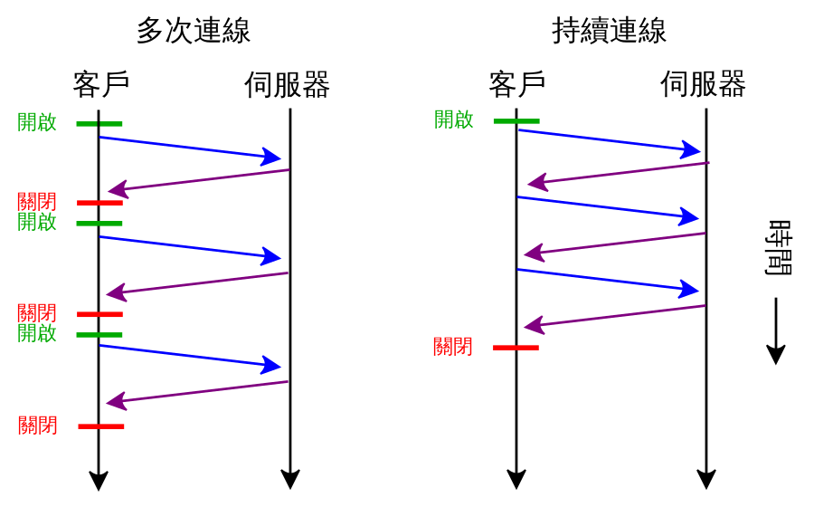
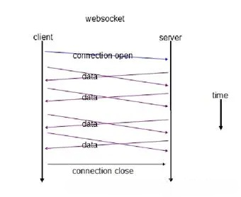

### http 长连接

http1.1 默认使用长连接（Connection: Keep-alive），一次请求响应结束后，TCP连接依然保持打开的状态，节省了多次请求时建立和断开TCP连接的开销，节约了带宽

图右开启了Keep-alive

但http本质上依然是客户端发起，服务端响应的模式，服务端无法主动推送数据，例如你想查询今天的天气，只能是客户端向服务器发起请求，服务器返回查询结果，做不到服务器主动推送消息

### websocket 长连接

相比于传统http的请求-应答模式，websocket是类似于tcp长连接的通讯模式，websocket建立连接后，除非客户端或服务端主动断开，连接会一直保持，后续数据都以帧序列的形式传输，在海量并发及客户端与服务器交互负载流量大的情况下，极大节省了网络带宽资源的消耗，有明显的性能优势

websocket 通信流程

1. 浏览器、服务器建立tcp连接，三次握手
2. 浏览器通过http协议向服务器请求升级协议，并发送支持的websocket版本号等信息
3. 服务器收到请求后，同样采用http协议回馈数据
4. 收到了连接成功的消息后，两端通过tcp通道进行传输通信

### Reference

- [HTTP长连接和WebSocket长连接的区别](https://blog.csdn.net/eleanoryss/article/details/109600154)
