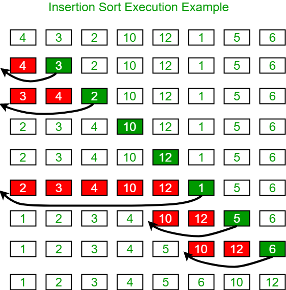

#### 原理

**不断在一个已经是有序的数组中，寻找合适位置并插入新元素**

#### 复杂度

时间复杂度 O(n²) 空间复杂度 O(1) 稳定排序算法

#### 实现步骤

首先我们把整个数组为有序区间，未排序区间，有序区间在插入排序一开始只有一个元素，就是数组的第一个元素

接在有序区间之后的一个元素就是准备插入的元素，在图中就是标为绿色的元素，该元素在有序区间内寻找位置并插入

寻找逻辑为：从后往前依次进行比较，**当待插入元素小于当前元素时，将当前元素后移一位，当待插入元素大于当前元素时，将待插入元素插入到当前元素的后一位**。不断重复该过程直到数组的最后一位



<!-- more -->

#### 参考代码



<!--tab golang-->

```go
func insertion_sort(nums []int) {
	for i := 0; i < len(nums); i++ {
        num := nums[i]
        j := i - 1
        // 当前指针指向的元素小于 num 时，后移一位
        for ; j >= 0 && nums[j] > num; j-- {
            nums[j+1] = nums[j]
        }
        // 在合适的位置插入 num
        // case 1: num 是最大的，不需要移动，nums[j+1] = num 等于没有移动元素
        // case 2: num 是最小的，需要移动到开头，此时 for 循环正常结束，下标为0处的元素还没有被替换，
        //         nums[j+1] = num 将最小的元素放在下标为0处
        // case 3: num 是中间的，需要移动到中间的某个位置，nums[j+1] = num 正常放置元素
        nums[j+1] = num
    }
}
```

<!--endtab-->

<!--tab python-->

```python
def insertion_sort(items):
    i = 1
    while i < len(items):
        cur = items[i]
        j = i - 1
        while j >= 0:
            if items[j] > cur:
                items[j + 1] = items[j]
                j -= 1
            else:
                break
        items[j + 1] = cur
        i += 1
    return items
```

<!--endtab-->


