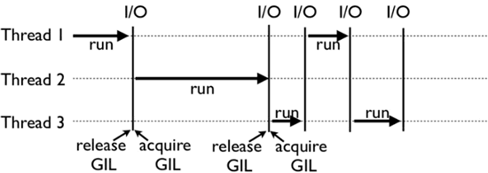
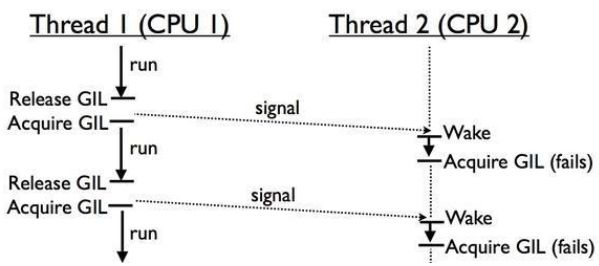

### 什么是 GIL 锁

GIL(Global Interpreter Lock) ，也称为全局解释器锁，官方解释如下：

In CPython, the global interpreter lock, or GIL, is a mutex that prevents multiple native threads from executing Python bytecodes at once. This lock is necessary mainly because CPython’s memory management is not thread-safe. (However, since the GIL exists, other features have grown to depend on the guarantees that it enforces.)

简单翻译一下就是：

GIL 是一个**互斥锁（Mutex）**，它防止多个线程同时执行 Python 字节码，这个锁是必要的，主要是因为 CPython 的内存管理不是线程安全的。

所以 **GIL 并不是 Python 的特性**，它出现在 CPython，IPython，PyPy 等 Python 解释器中，也不是所有解释器都有 GIL，像 Jython，IronPython 是没有的。

<!-- more -->

### GIL 为 Python 解决了什么问题

Python 使用**引用计数**来进行内存管理，任何创建的对象都具有引用计数变量，该变量用于跟踪指向该对象的引用数。当引用计数的值为 0 时，GC 就会释放对象占用的内存

示例：

```python
>>> import sys
>>> a = []
>>> b = a
>>> sys.getrefcount(a)
3
```

在上面的示例中，空列表对象的引用计数值为 3，a 和 b 参数引用各一次，在调用`sys.getrefcount()`的时候也引用一次。

回到 GIL：

**这个引用计数变量需要防止竞争条件**，如果多个线程同时修改这个值，可能会导致**内存泄漏**现象的产生。


### GIL 锁的产生

通过向跨线程共享的所有数据结构添加锁，可以保证引用计数变量的安全性，从而保证不会对它们进行不一致的修改。

但是为每个对象添加一个锁意味着将存在多个锁，可能会导致以下两种情况的产生：

- 死锁（线程之间互相争抢锁资源）
- 反复获取和释放锁而导致性能下降

为了保证单线程情况下 Python 的正常执行和效率，GIL锁（单一锁）由此产生了。**任何 Python 字节码的执行都需要获取解释器锁**。这样可以防止死锁（因为只有一个锁），并且不会带来太多的性能开销。**但这也让任何受 CPU 限制的 Python 程序都是单线程的**。


### GIL锁的底层原理

单核 CPU 线程调度方式：

[](https://img2020.cnblogs.com/blog/1868812/202104/1868812-20210423133123603-647801523.jpg)

线程1,2,3共享 GIL 锁，谁在 CPU 执行，谁就占有这把锁，直到线程因为 IO 操作或者 Timer Tick 到期让出 CPU，没有执行的线程就安静的等待着这把锁。

IO 操作很好理解，比如发出一个 http 请求，等待响应。那么 Time Tick 到期是什么呢？Time Tick 规定了每个线程执行的时间，超过时间后自动释放 GIL 锁。


在多核CPU下，由于GIL锁的全局特性，无法发挥多核的优势，GIL锁会使得多线程任务的效率大大降低：

如果线程2需要在 CPU 2 上执行，它需要先等待在 CPU 1 上执行的线程1释放GIL。如果线程1是因为 IO 阻塞让出的 GIL，那么线程2必定拿到 GIL。但如果线程1是因为 timer ticks 到期让出的 GIL，那么这个时候线程1和线程2公平竞争。但要命的是，在 Python 2.x, 线程1不会动态的调整自身的优先级，所以很大概率下次被选中执行的还是线程1，在很多个这样的选举周期内，线程2只能安静的看着线程1拿着 GIL 在 CPU 1 上欢快的执行。

注意：

- Python 内置了一种机制，强制线程在执行**固定的间隔后**释放 GIL，IO 密集型线程会被“饿死”，因为无法从 CPU 密集型线程上获取 GIL 机会，针对该问题，Python 3.2 对 GIL 做过优化，不允许当前线程在其他线程有机会运行之前重新获取 GIL


### Python  GIL 不能绝对保证线程安全

多个线程操作同一个全局变量还是会存在线程不安全的问题，演示代码如下：

```python
import dis
n = 0

def add():
    global n
    n = n + 1

print(dis.dis(add))

def sub():
    global n
    n = n - 1
print(dis.dis(sub))
```

dis 方法可以打印出一个函数对应的字节码执行过程，不管是加法还是减法运算，都会分为4步完成，这4步操作**不具备原子性**。在多个线程同时执行 add(), sub() 时，线程的 GIL 锁随时都有可能被释放， 导致 n 的结果不确定


### 如何处理 Python 的GIL

- IO密集型

  多线程和多进程性能区别并不大，原因在于即使有 GIL 锁的存在，由于线程中的 IO 操作会使得线程立刻释放 GIL，切换到其他非 IO 线程继续执行，提高程序执行效率，相比进程操作，线程操作更加轻量，线程之间的通信复杂度更低，建议使用多线程

- 计算密集型

  尽量使用多进程或者协程来代替多线程（使用多进程时，每个进程都有自己的 Python 解释器和内存空间，GIL 锁也是各自独立的）

  

### Reference

- [Python的GIL详解](https://blog.nowcoder.net/n/f6999765005349b3b47ab8e8921dc898)
- [深入了解GIL锁](https://www.cnblogs.com/jiakecong/p/14693491.html)
- [深入理解Python中的GIL](https://zhuanlan.zhihu.com/p/75780308)
- [Python之GIL](https://www.jianshu.com/p/dbc3f3ceb5a7)
