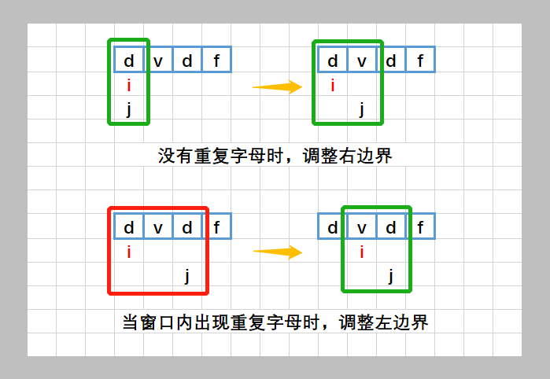

### [3. 无重复字符的最长子串](https://leetcode-cn.com/problems/longest-substring-without-repeating-characters/)

给定一个字符串 `s` ，请你找出其中不含有重复字符的 **最长子串** 的长度。

<!-- more -->

**示例 1**:

```
输入: s = "abcabcbb"
输出: 3 
解释: 因为无重复字符的最长子串是 "abc"，所以其长度为 3。
```

**示例 2**:

```
输入: s = "bbbbb"
输出: 1
解释: 因为无重复字符的最长子串是 "b"，所以其长度为 1。
```

**示例 3**:

```
输入: s = "pwwkew"
输出: 3
解释: 因为无重复字符的最长子串是 "wke"，所以其长度为 3。
     请注意，你的答案必须是 子串 的长度，"pwke" 是一个子序列，不是子串。
```

**示例 4**:

```
输入: s = ""
输出: 0
```

 

**提示**：

- `0 <= s.length <= 5 * 104`
- `s` 由英文字母、数字、符号和空格组成


### Solutions



- 题解一

  存在问题：每次移动右指针都更新了窗口长度，属于多余操作，可以优化

  ```go
  func lengthOfLongestSubstring(s string) int {
      mapping := map[byte]struct{}{}
      ans := 0
      for l, r := 0, 0; r < len(s); {
          char := s[r]
          if _, ok := mapping[char]; ok {
              delete(mapping, s[l])
              l++
          } else {
              mapping[char] = struct{}{}
              r++
          }
          ans = max(r-l, ans)
      }
      return ans
  }
  
  func max(a, b int) int {
      if a > b {
          return a
      }
      return b
  }
  ```

- 优化版

  ```go
  func lengthOfLongestSubstring(s string) int {
      mapping := map[byte]int{}
      ans := 0
      for l, r := 0, 0; r < len(s); l++ {
          if l != 0 {
              delete(mapping, s[l-1])
          }
          for ; r < len(s) && mapping[s[r]] == 0; r++ {
              mapping[s[r]]++
          }
          ans = max(r-l, ans)
      }
      return ans
  }
  
  func max(a, b int) int {
      if a > b {
          return a
      }
      return b
  }
  ```

  
