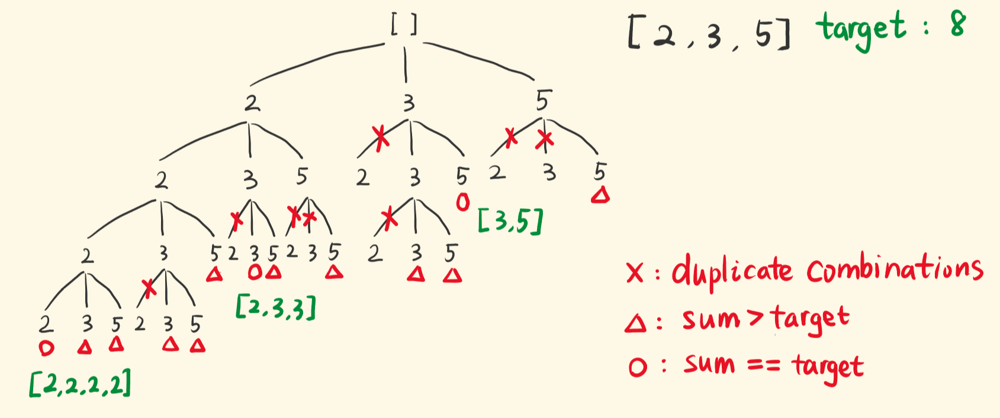

### [39. 组合总和](https://leetcode-cn.com/problems/combination-sum/)

给你一个 **无重复元素** 的整数数组 `candidates` 和一个目标整数 `target` ，找出 `candidates` 中可以使数字和为目标数 `target` 的 **所有不同组合** ，并以列表形式返回。你可以按 **任意顺序** 返回这些组合。

`candidates` 中的 **同一个** 数字可以 **无限制重复被选取** 。如果至少一个数字的被选数量不同，则两种组合是不同的。 

对于给定的输入，保证和为 `target` 的不同组合数少于 `150` 个。

<!-- more -->

**示例 1**：

```
输入：candidates = [2,3,6,7], target = 7
输出：[[2,2,3],[7]]
解释：
2 和 3 可以形成一组候选，2 + 2 + 3 = 7 。注意 2 可以使用多次。
7 也是一个候选， 7 = 7 。
仅有这两种组合。
```

**示例 2**：

```
输入: candidates = [2,3,5], target = 8
输出: [[2,2,2,2],[2,3,3],[3,5]]
```

**示例 3**：

```
输入: candidates = [2], target = 1
输出: []
```

**示例 4**：

```
输入: candidates = [1], target = 1
输出: [[1]]
```

**示例 5**：

```
输入: candidates = [1], target = 2
输出: [[1,1]]
```

 

**提示**：

- `1 <= candidates.length <= 30`
- `1 <= candidates[i] <= 200`
- `candidate` 中的每个元素都 **互不相同**
- `1 <= target <= 500`


### Solutions

做这种回溯的题，最好提前把路线图画出来



```go
func combinationSum(candidates []int, target int) [][]int {
    var (
        ans       [][]int
        l         = len(candidates)
        backtrack func(candidate []int, diff, index int)
    )
    backtrack = func(candidate []int, diff, index int) {
        if diff >= 0 {
            if diff == 0 {
                newCandidate := make([]int, len(candidate))
                copy(newCandidate, candidate)
                ans = append(ans, newCandidate)
                return
            }
            for i := index; i < l; i++ {
                num := candidates[i]
                v := diff - num
                backtrack(append(candidate, num), v, i)
            }
        }
    }
    backtrack([]int{}, target, 0)
    return ans
}
```

