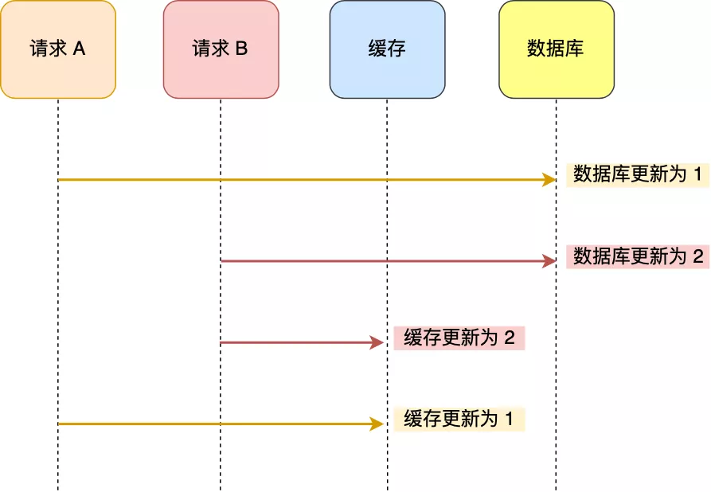
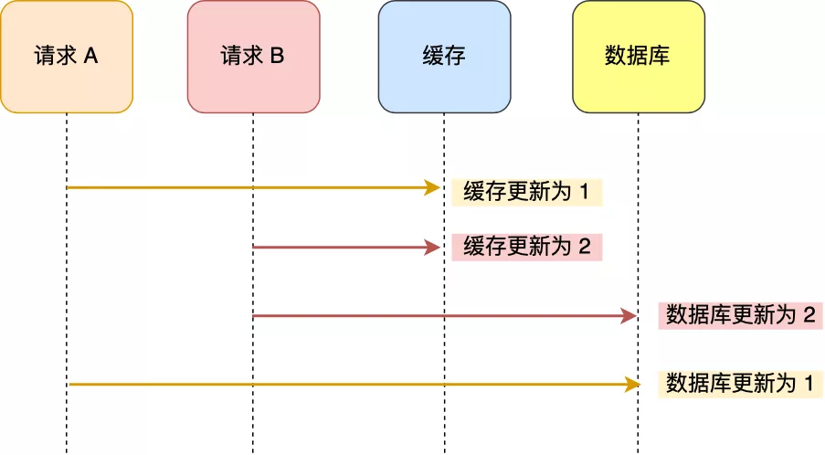
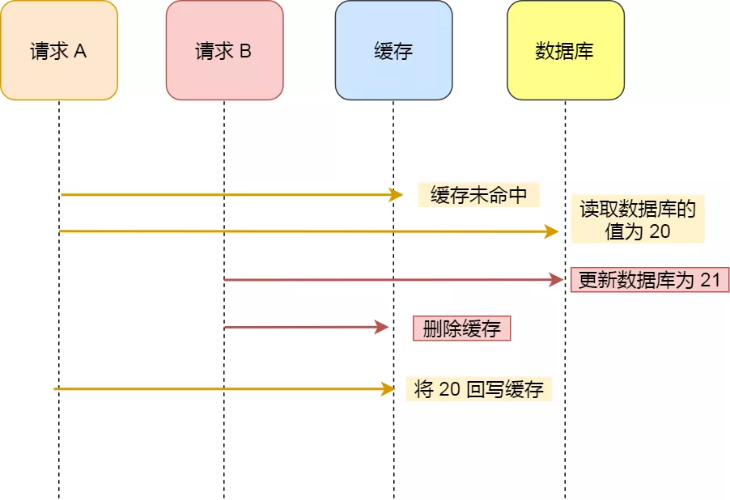
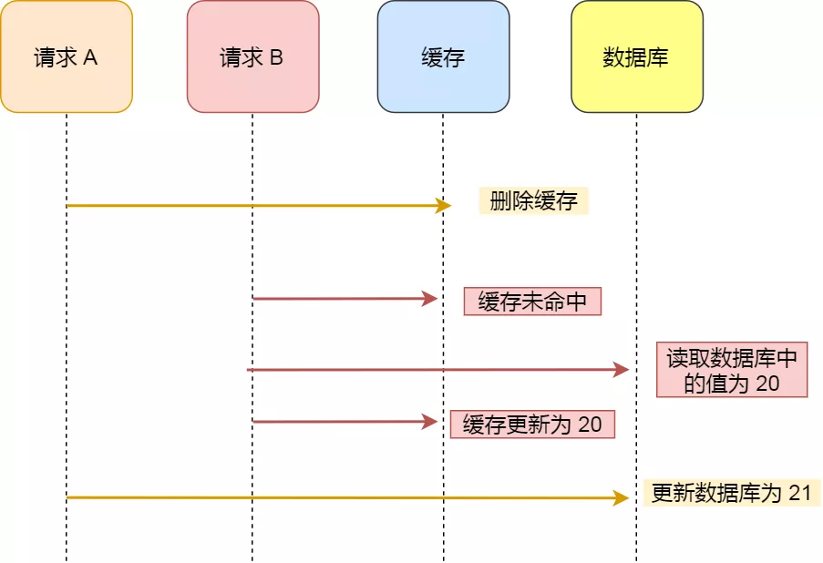

### TL;DR

1. 更新数据库 + 更新缓存方案，在「并发」场景下无法保证缓存和数据一致性，解决方案是加「分布锁」，但这种方案存在「缓存资源浪费」和「机器性能浪费」的情况
1. 采用「先删除缓存，再更新数据库」方案，在「并发」场景下依旧有不一致问题，解决方案是「延迟双删」，但这个延迟时间很难评估
1. 采用「先更新数据库，再删除缓存」方案，为了保证两步都成功执行，需配合「消息队列」或「订阅变更日志」的方案来做，本质是通过「重试」的方式保证数据最终一致
1. 采用「先更新数据库，再删除缓存」方案，「读写分离 + 主从库延迟」也会导致缓存和数据库不一致，缓解此问题的方案是「延迟双删」，凭借经验发送「延迟消息」到队列中，延迟删除缓存，同时也要控制主从库延迟，尽可能降低不一致发生的概率

<!-- more -->

### 具体情况分析

1. 无论是**先更新数据库，再更新缓存**，还是**先更新缓存，再更新数据库**，都存在两个问题：

   1. 并发问题

      当两个请求**同时更新**同一条数据的时候，**可能会出现缓存与数据库不一致的问题**，可以通过加**分布式锁**的方式解决，但会影响写入性能

      

      先更新数据库，再更新缓存

      

      先更新缓存，再更新数据库

      

   2. 缓存利用率问题

      每次数据发生变更，都**无脑**更新缓存，缓存中可能存放了很多不常访问的数据，并且缓存可能是通过一系列计算得到的，无脑更新缓存不仅利用率不高，还会造成机器性能的浪费

   

2. **先更新数据库，再删除缓存**，该策略称为 Cache Aside，中文名叫旁路缓存策略，**可以保证数据一致性**，因为回写缓存的速度远远快于数据库的写入速度，很难出现请求B已经更新了数据库并删除了缓存，请求A才将旧值回写到缓存的情况，如图

   

   

   但是**先更新数据库，再删除缓存**的策略也存在问题，毕竟是两个操作，只要第二步发生失败，还是会导致缓存和数据库不一致，那么如何保证两个操作同时成功呢？

   1. 重试

      依然存在问题：

      - 立刻重试很大概率还会失败
      - 重试次数设置多少合理？
      - 线程会一直阻塞，直到重试操作结束

   2. 异步重试

      更新缓存的操作放入消息队列，消息队列保证**可靠性**，保证**消息的成功传递**，最终由消费者来操作缓存

   

   如果不想在应用中去写消息队列，是否有更简单的方案，同时又可以保证一致性呢？

   **订阅数据库变更日志，再操作缓存**，这样我们只需更新数据库，无需操作缓存，该方案的有点在于：

   - 无需考虑写消息队列失败的情况：只要Mysql成功，Binlog肯定会有
   - 自动投递道下游队列：开源中间件，如阿里的canal等，可以自动把数据库变更日志投递给下游的消息队列

   

3. **先删除缓存，再更新数据库**，在**读写并发**的情况下，还是会出现缓存与数据库不一致的问题，如图：

   

   解决方案是**延迟双删**，但延迟时间很难评估：

   该方案的前提条件是：请求A睡眠的时间大于请求B**读取数据库并写入缓存的时间**，但是具体睡眠多久是个**玄学**，很难评估出来，所以这个方案也只是**尽可能**保证一致性而已，极端情况下，依然会出现缓存不一致的现象

   

### Reference

- [小林-图解Redis](https://mp.weixin.qq.com/s/kZJcGkOMYqLzUsmbGTruYA)
- [缓存和数据库一致性问题，看这篇就够了](http://kaito-kidd.com/2021/09/08/how-to-keep-cache-and-consistency-of-db/)

